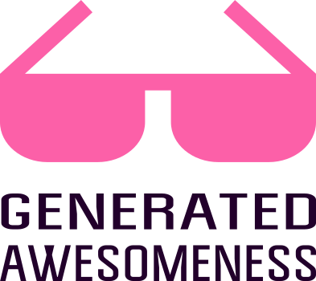

# Generated awesomeness

This is the list of autogenerated awesome lists. Generated by [awesome-generator](https://github.com/orsinium/awesome-generator) over [Github search API](https://developer.github.com/v3/search/#search-repositories).

* Projects are grouped by topics.
* Topics are sorted by alphabet.
* Projects into topic are sorted by the stars.

## By languages

1. [Bash](languages/bash.md)
1. [C#](languages/csharp.md)
1. [C++](languages/cpp.md)
1. [Clojure](languages/clojure.md)
1. [CSS](languages/css.md)
1. [Go (golang)](languages/go.md)
1. [Haskell](languages/haskell.md)
1. [Java](languages/java.md)
1. [JavaScript](languages/js.md)
1. [Kotlin](languages/kotlin.md)
1. [Objective-C](languages/objective-c.md)
1. [PHP](languages/php.md)
1. [Python](languages/python.md)
1. [Ruby](languages/ruby.md)
1. [Rust](languages/rust.md)
1. [Scala](languages/scala.md)
1. [Swift](languages/swift.md)
1. [TypeScript](languages/typescript.md)

## By topics

1. [Android](topics/android.md)
1. [Angular](topics/angular.md)
1. [Ansible](topics/ansible.md)
1. [Awesome list](topics/awesome-list.md)
1. [Bash](topics/bash.md)
1. [Blockchain](topics/blockchain.md)
1. [Django](topics/django.md)
1. [Docker](topics/docker.md)
1. [GameDev](topics/gamedev.md)
1. [Git](topics/git.md)
1. [GraphQL](topics/graphql.md)
1. [iOS](topics/ios.md)
1. [Linux](topics/linux.md)
1. [Machine learning](topics/machine-learning.md)
1. [Monitoring](topics/monitoring.md)
1. [Nodejs](topics/nodejs.md)
1. [OS X](topics/osx.md)
1. [React](topics/react.md)
1. [REST](topics/rest.md)
1. [Ruby on Rails](topics/ruby-on-rails.md)
1. [Security](topics/security.md)
1. [Serverless](topics/serverless.md)
1. [Vue](topics/vue.md)

## More

Looking for any other list? Generate it yourself by the [awesome-generator](https://github.com/orsinium/awesome-generator) and contribute. No any manual editing. Full auto-generation.

## License

